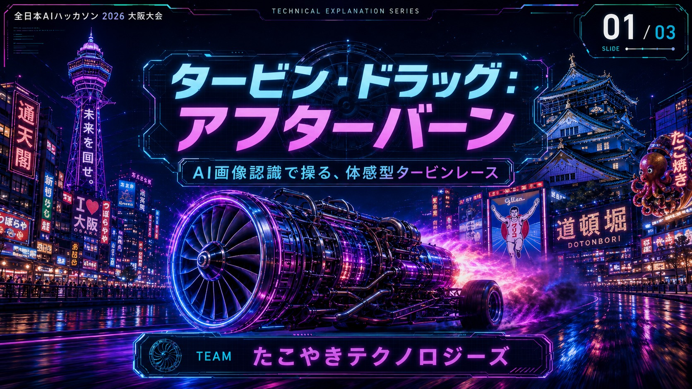
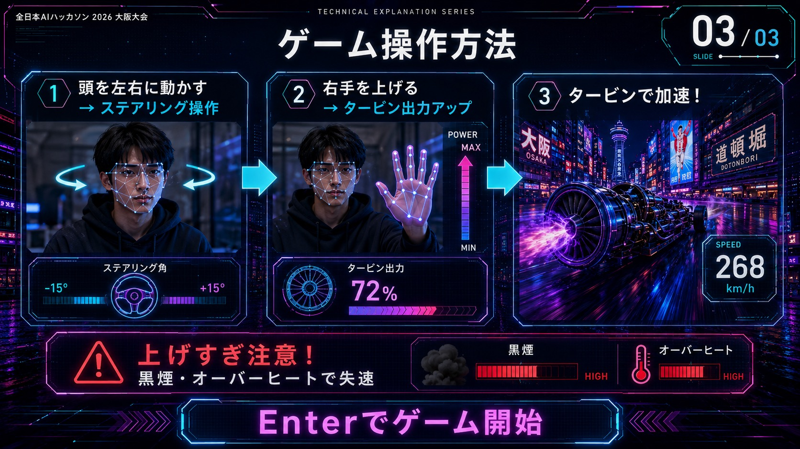
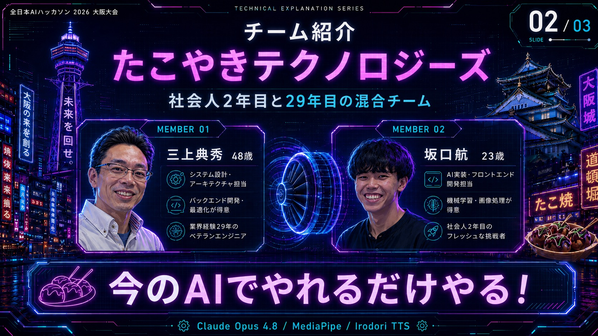

<div align="center">

# 🏎️ タービン・ドラッグ：アフターバーン<br>TURBINE DRAG ▸ AFTERBURN

**AI画像認識（MediaPipe）で操作する、コントローラー不要の体感型タービンレース**

### ▶️ いますぐブラウザでプレイ

## **https://kou-playground.github.io/ai-hack2026-osaka-takoyaki/turbine_dragster_afterburn.html**

<sub>↑ カメラ付きPC（Chrome / Edge 推奨）で開いてください。インストール不要。</sub>

<br>



</div>

---

## 🏆 全日本AIハッカソン 2026 大阪大会 出展作品

本作は **「全日本AIハッカソン 2026 Powered by THIRDWAVE」** の予選オフライン大阪大会（2026年5月30日 / 大阪・梅田）で、チーム **たこやきテクノロジーズ** が制作したハッカソン作品です。

- **大会名**：全日本AIハッカソン 2026 Powered by THIRDWAVE
- **ラウンド**：予選3rdラウンド オフライン大阪大会
- **開催日**：2026年5月30日（土）／会場：TKPガーデンシティ大阪梅田
- **主催**：株式会社サードウェーブ（ドスパラ）
- **形式**：2名1チームで制限時間内に作品を完成させて競う（優勝賞金10万円）
- **テーマ**：「今のAIでやれるだけやる！」

> 各予選ラウンドの勝者は、2026年11月7日（東京）で開催される決勝へ進出します。

---

## 🎮 これはどんなゲーム？

コントローラーもキーボードも（ほぼ）使いません。**Webカメラに映ったあなたの体そのものがコントローラー**です。

- 🧠 **顔の向き**でステアリング（カーブ）
- ✋ **手の高さ**でタービン（エンジン）の出力
- ⏱️ 制限時間 **30秒**で、ネオン街・大阪を駆け抜けて **最高速度**と **走行距離**を伸ばそう！

AIアナウンサーの実況（音声合成）が走りを熱く盛り上げます。

---

## 🕹️ 操作方法（はじめての人もこれを読めばOK）



| 操作 | やり方 | 効果 |
|---|---|---|
| 🚗 ステアリング | **頭を左右に動かす** | 顔が向いた方向にマシンが曲がる |
| 🔥 タービン出力（アクセル） | **右手を上げる**（手が高いほど全開） | スピードアップ |
| ⏭️ 画面送り / スキップ | **クリック** または **Enter** キー | スライド・オープニング/エンディング動画を送る |

### ⚠️ 上げすぎ注意 ― HEAT（オーバーヒート）システム

- 手を上げ続けてタービン出力が高いままだと **HEAT（熱）ゲージ**が上昇します。
- **HEAT が 100% になるとオーバーヒート**！ 黒煙を吹いて **強制クールダウン → 失速**します。
- 障害物に当たっても HEAT が上がります。
- ときどき手を下げて熱を逃がしつつ、いかに長く全開を維持できるかが攻略のカギ。

### 遊びの流れ

1. **`CAMERA ON / START`** ボタンを押してカメラ使用を許可
2. 説明スライド（3枚）→ オープニング動画（`Enter`でスキップ可）
3. **3, 2, 1, GO!** のカウントダウン後、**30秒間の本番レース**
4. タイムアップでリザルト表示（最高速度・走行距離）→ エンディング

---

## 💻 動作環境・必要なもの

- **Webカメラ付きのPC**（顔と手が映る明るい環境だと認識が安定します）
- **モダンブラウザ**：Google Chrome / Microsoft Edge を推奨
- **インターネット接続**（MediaPipe・Three.js・実況音声をオンラインから取得します）
- カメラ映像はブラウザ内のAI処理にのみ使われ、**どこにも保存・送信されません**

> 💡 認識がうまくいかないときは、顔全体が画面に入り、手をカメラにしっかり見せられる距離・明るさに調整してください。

---

## 👥 制作チーム ― たこやきテクノロジーズ



社会人2年目と29年目の **混合タッグ**。「今のAIでやれるだけやる！」を合言葉に制作しました。

| | メンバー | 担当 |
|---|---|---|
| **MEMBER 01** | 三上 典秀（48） | システム設計・アーキテクチャ／バックエンド開発・最適化（業界経験29年のベテラン） |
| **MEMBER 02** | 坂口 航（23） | AI実装・フロントエンド開発／機械学習・画像処理（社会人2年目の挑戦者） |

---

## 🛠️ 使用技術

| 分野 | 技術 |
|---|---|
| 体の認識（顔・手） | [MediaPipe](https://developers.google.com/mediapipe) Face Mesh / Hands |
| 3D描画 | [Three.js](https://threejs.org/) (r128) |
| 実況音声（TTS） | Irodori TTS |
| サウンド | Web Audio API（ジェット音・効果音をリアルタイム合成） |
| 開発 | Claude Opus 4.8 |
| ホスティング | GitHub Pages |

すべて **1枚の HTML ファイル**（`turbine_dragster_afterburn.html`）で完結しています。

---

## 🚀 ローカルで動かす

カメラAPIはセキュアな文脈でのみ動くため、ファイルを直接開くのではなく **`localhost` でサーバー起動**してアクセスしてください。

```bash
# このリポジトリを取得
git clone https://github.com/Kou-playground/ai-hack2026-osaka-takoyaki.git
cd ai-hack2026-osaka-takoyaki

# 簡易サーバーを起動（Python がある場合）
python -m http.server 5501
```

ブラウザで **http://localhost:5501/turbine_dragster_afterburn.html** を開けばプレイできます。
（VS Code の Live Server 拡張機能を使う場合はポート `5501` で `turbine_dragster_afterburn.html` を起動）

---

## 📁 ファイル構成

```
.
├── index.html                        # ゲーム本体へのリダイレクト
├── turbine_dragster_afterburn.html   # ゲーム本体（すべてのロジック）
└── assets/
    ├── 1.jpg / 2.jpg / 3.jpg         # 導入スライド（タイトル・チーム・操作説明）
    ├── opening.mp4 / ending.mp4      # オープニング／エンディング動画
    ├── ending.jpg                    # エンディング静止画
    └── bgm_game.mp3                  # ゲーム中BGM
```

---

<div align="center">

**全日本AIハッカソン 2026 大阪大会 — TEAM たこやきテクノロジーズ**

🐙 *今のAIで、やれるだけやる。*

</div>
